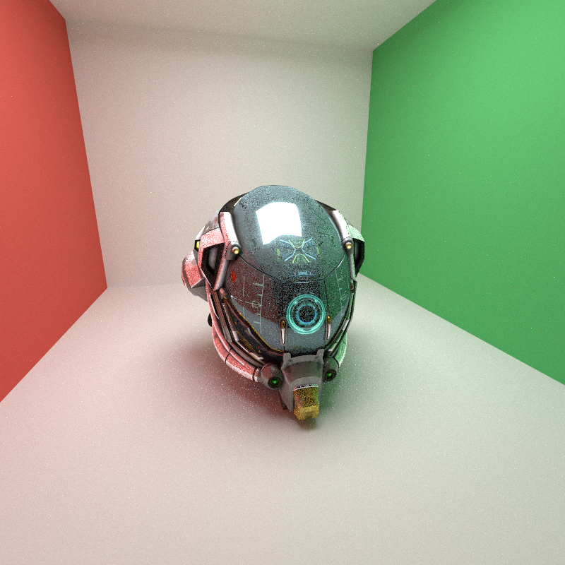
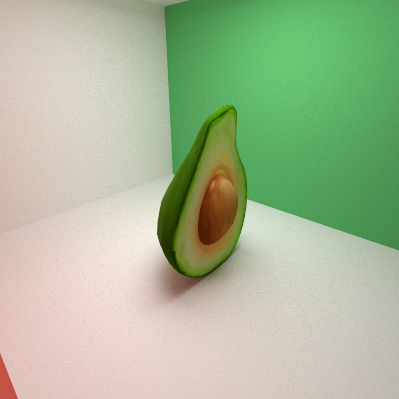
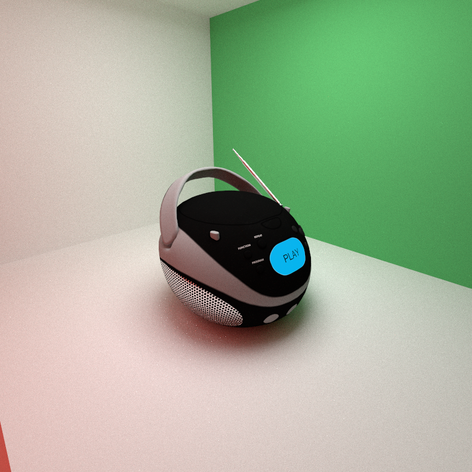
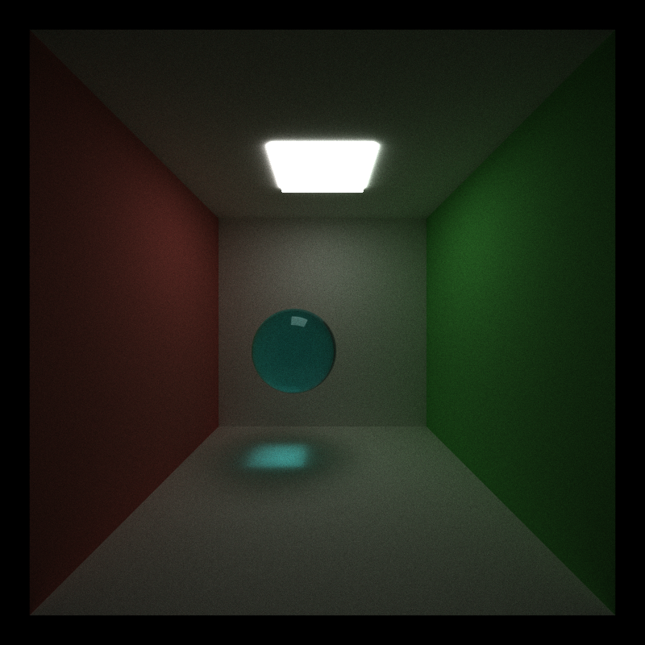
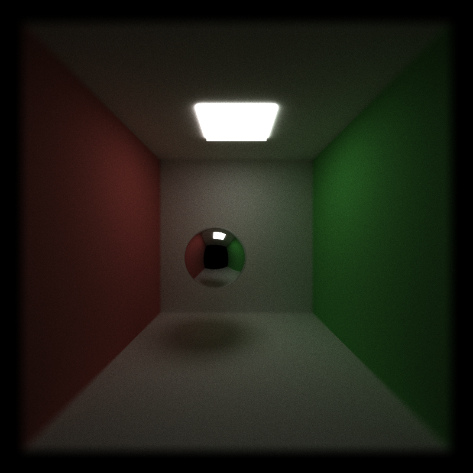

# CUDA Path Tracer

This project is a CUDA GPU path tracer for progressively rendering globally illuminated scenes. For each pixel, the renderer launches a path, intersects analytic primitives or triangle meshes, evaluates a material, and continues the path until it misses, reaches the configured bounce limit, or is terminated by an optimization. The accumulated image is previewed through CUDA/OpenGL interoperability and can be saved as an 8-bit PNG.

| Item | Information |
| --- | --- |
| Course context | University of Pennsylvania, CIS 565 GPU Programming and Architecture, Project 3 |
| Main entry points | `src/main.cpp`, `src/pathtrace.cu` |
| Scene format | JSON, parsed with `nlohmann::json` |
| Window/GPU path | CUDA + OpenGL/GLFW/GLEW + Dear ImGui |
| Author/contact | [TODO: add name, email, and repository link] |
| Validation status | Static validation performed on 2026-09-21; this documentation pass did not rebuild or launch the renderer |



*Representative result: the Damaged Helmet glTF scene at 800x800.*

## Overview

The renderer combines the required path-tracing pipeline with GPU-oriented path management and mesh acceleration:

- analytic spheres and cubes;
- a supported glTF 2.0 triangle-mesh subset with node transforms, materials, UVs, and textures;
- diffuse, glossy/perfect reflection, JSON-defined refraction, and emissive materials;
- stochastic antialiasing, thin-lens depth of field, and Russian roulette termination;
- AABB culling, per-mesh BVHs, and a top-level BVH over mesh ranges;
- work-efficient stream compaction and optional material-type sorting;
- a CUDA-OpenGL progressive preview with ImGui runtime controls.

The project is intended to make path count, memory movement, shading divergence, and geometric acceleration visible and measurable on a CUDA GPU rather than being only an offline image generator.

## Render Gallery

The images below are 800x800 PNGs already present under `img/`. Filenames retain the scene name, UTC save time, and sample count. The repository currently has saved outputs for only the three glTF scenes shown here; JSON scenes for Fox, Lantern, and Cesium Milk Truck are included but do not have matching images in `img/`.

| Scene | Existing result |
| --- | --- |
| Avocado glTF |  |
| BoomBox glTF |  |
| Damaged Helmet glTF |  |

The Avocado image shows a textured organic mesh under the green-wall Cornell lighting. The BoomBox image exposes small high-contrast details such as the blue `PLAY` button and speaker grille. The Damaged Helmet image is useful for inspecting glossy/metallic response, emissive-looking details, and the remaining Monte Carlo noise at a saved 8008-sample checkpoint.

### Analytic scene and depth of field



*Cornell box with red/green side walls, a ceiling area light, and a refractive sphere. This demonstrates analytic geometry, JSON materials, and indirect illumination.*

| Depth-of-field focus | Existing result |
| --- | --- |
| Focus near the sphere |  |
| Focus near the back wall |  |

These two images exercise `APERTURE` and `FOCALDIST` in the thin-lens camera. They still contain Monte Carlo noise; the project does not include a denoiser or artistic tone-mapping stage.

## Feature Summary

| Feature | Implementation |
| --- | --- |
| Ray generation and accumulation | `pathtrace.cu::generateRayFromCamera` and `finalGather`; a linear GPU accumulation buffer is updated every iteration |
| Diffuse BSDF | `interactions.cu::scatterRay`, cosine-weighted hemisphere sampling |
| Stochastic antialiasing | Per-pixel jitter, controlled by `Enable Antialiasing (Jitter)` |
| Stream compaction | `mapActivePaths` -> Blelloch scan -> `scatterActivePaths`; scan code is in `stream_compaction/efficient.cu` |
| Adaptive compaction | Runs scan/scatter only when the active-path ratio and minimum-path thresholds make it worthwhile |
| Material sorting | `thrust::sort_by_key` buckets paths by emissive, specular, refractive, diffuse, miss, or dead behavior |
| Analytic intersections | Transformed sphere and cube tests |
| Triangle intersections | Moller-Trumbore intersection with interpolated normals and UVs |
| glTF loading | `tinygltf3`, node hierarchy, TRS/matrix transforms, indexed or non-indexed triangle primitives, primitive material remapping |
| Two-level mesh acceleration | Per-`MeshRange` triangle BVH followed by a top-level BVH over mesh-range AABBs |
| AABB culling | Slab tests reject whole mesh ranges before triangle tests |
| JSON refraction | `glm::refract`, Schlick Fresnel, and total-internal-reflection handling |
| Depth of field | Disk-sampled thin lens when `APERTURE > 0` |
| Russian roulette | Optional unbiased termination after at least three bounces, with surviving throughput reweighted |
| glTF textures | Base-color, emissive, and metallic-roughness textures packed into a contiguous GPU atlas; nearest sampling with wrapping |
| Display/output conversion | CUDA preview and PNG saving convert linear radiance to sRGB before 8-bit output |

## Rendering Pipeline

```text
scene.json
   |
   +--> Scene: analytic geometry / glTF triangles / materials / textures
   |          |
   |          +--> CPU: build per-mesh BVHs and a top-level MeshRange BVH
   |          +--> CUDA: upload paths, triangles, materials, and texture atlas
   |
   +--> each progressive iteration
          1. generateRayFromCamera (8x8 CUDA blocks)
          2. computeIntersections (128-thread 1D blocks)
             analytic primitives + AABB/TLAS/per-mesh BVH traversal
          3. optional material-type sort
          4. shadeFakeMaterial and scatterRay
          5. gather terminated paths into the image
          6. optional map/scan/scatter stream compaction
          7. accumulate and write the OpenGL PBO
```

Each `PathSegment` carries a ray, pixel index, remaining bounces, radiance, and throughput. The throughput contains the product of material response and sampling-probability corrections; the path color contains radiance already collected along that path. JSON `Emitting` materials terminate a path. A glTF emissive factor contributes radiance but does not automatically turn the mesh into a terminating light, so the mesh can continue through its normal diffuse/specular shading path.

## glTF Support

`Scene::loadGLTFObject` recursively walks the default glTF scene, combines node transforms with the JSON object transform, and writes world-space triangles into the renderer's shared `Triangle` array. The supported geometry subset is:

- `POSITION` as `VEC3 FLOAT` (required);
- optional `NORMAL` as `VEC3 FLOAT` (otherwise a face normal is used);
- optional `TEXCOORD_0` as `VEC2 FLOAT`;
- unsigned byte, unsigned short, or unsigned int index buffers;
- non-indexed triangles whose vertices are already listed in groups of three;
- per-primitive material assignment.

Images can be loaded from external URIs, base64 data URIs, or embedded buffer views. Base-color and emissive images are decoded from sRGB into the renderer's linear working space. Metallic-roughness images remain linear; the shader uses the G channel as roughness and the B channel as metallic. `MASK` and `BLEND` alpha modes and `doubleSided` are represented in the material path, but image loading currently requests RGB only, so texture alpha itself is unavailable.

Supported material data is a practical subset of glTF PBR: base-color, emissive, metallic/roughness factors and textures, `alphaMode`, `alphaCutoff`, and `doubleSided`. Normal maps, clearcoat, sheen, and `KHR_materials_transmission` are not implemented. In particular, glTF transmission is not connected to the JSON `Refractive` path.

## BVH and Intersection Acceleration

On the CPU, any `MeshRange` containing at least 16 triangles receives a midpoint-split BVH. The builder chooses the largest centroid extent as the split axis, uses a maximum leaf size of four triangles and a maximum depth of 32, and reorders the triangle buffer into BVH order. A second BVH is built over all mesh-range AABBs.

On the GPU, traversal uses an explicit stack. A ray first tests the top-level nodes, then the candidate mesh ranges, and finally the per-mesh triangle BVH. If Mesh BVH is disabled, the code falls back to iterating over all triangles in each candidate range. The implementation uses midpoint splitting rather than SAH, and small ranges intentionally may remain brute force; no universal speedup is assumed without measurement.

## Scene File Format

The executable accepts exactly one JSON scene path:

```text
cis565_path_tracer.exe SCENEFILE.json
```

### Materials

`Materials` maps names to material definitions:

```json
{
  "Materials": {
    "white":  { "TYPE": "Diffuse",    "RGB": [0.92, 0.92, 0.92] },
    "light":  { "TYPE": "Emitting",   "RGB": [1.0, 1.0, 1.0], "EMITTANCE": 8.0 },
    "mirror": { "TYPE": "Specular",   "RGB": [0.98, 0.98, 0.98], "ROUGHNESS": 0.0 },
    "glass":  { "TYPE": "Refractive", "RGB": [0.5, 0.98, 1.0], "IOR": 1.5 }
  }
}
```

`Specular.ROUGHNESS` is the implementation's 0-to-1 roughness proxy for the glossy reflection branch. `Refractive.IOR` defaults to 1.5 when omitted.

### Objects

Analytic objects use `TYPE: "cube"` or `TYPE: "sphere"` and provide `MATERIAL`, `TRANS`, `ROTAT`, and `SCALE`. A glTF object uses the same transform fields plus a `PATH` resolved relative to the JSON scene file:

```json
{
  "TYPE": "gltf",
  "MATERIAL": "white",
  "PATH": "models/Avocado.glb",
  "TRANS": [0.0, 0.004, 0.0],
  "ROTAT": [0.0, 0.0, 0.0],
  "SCALE": [90.0, 90.0, 90.0]
}
```

### Camera

Required camera fields are `RES`, `FOVY`, `ITERATIONS`, `DEPTH`, `FILE`, `EYE`, `LOOKAT`, and `UP`. `APERTURE` and `FOCALDIST` are optional. An aperture of zero uses a pinhole camera. If depth of field is enabled and `FOCALDIST` is missing or invalid, it falls back to the distance from `EYE` to `LOOKAT`.

## Bundled Scenes and Assets

Six runnable glTF scenes are provided in `scenes/`, with their models in `scenes/models/`. They use Cornell-style rooms with a ceiling light and red/green side walls so that models can be compared under a common lighting setup.

| Scene JSON | Model | Configured `ITERATIONS`, `DEPTH` |
| --- | --- | --- |
| `render_avocado.json` | `Avocado.glb` | 5120, 8 |
| `render_boombox.json` | `BoomBox.glb` | 5120, 8 |
| `render_milk_truck.json` | `CesiumMilkTruck.glb` | 5120, 8 |
| `render_damaged_helmet.json` | `DamagedHelmet.glb` | 10000, 8 |
| `render_fox.json` | `Fox.glb` | 5120, 8 |
| `render_lantern.json` | `Lantern.glb` | 5120, 8 |


## Build

### Requirements

- an NVIDIA GPU and CUDA Toolkit;
- CMake 3.24 or newer;
- C++17 and CUDA 17 toolchains;
- OpenGL;
- on Windows, the vendored GLFW, GLEW, and GLM dependencies under `external/`; on Linux, system-discoverable GLFW/GLEW plus GLM;
- a desktop session capable of creating an OpenGL window for interactive preview.

The CMake project also builds the `stream_compaction` subdirectory and sets `CUDA_ARCHITECTURES=native`. If the local CMake/NVIDIA toolchain does not accept `native`, configure an explicit architecture suitable for the target GPU.

### CMake (recommended)

```powershell
cmake -S . -B build
cmake --build build --config Release --parallel
```

With the Windows multi-configuration generator used by the existing checkout, the executable is normally:

```text
build/bin/Release/cis565_path_tracer.exe
```

For a single-configuration generator it is usually `build/bin/cis565_path_tracer`. The repository also contains a `GNUmakefile` wrapper, but the CMake commands above are the canonical cross-platform entry point.

## Running and Controls

Run from the repository root so relative scene paths resolve as expected:

```powershell
.\build\bin\Release\cis565_path_tracer.exe .\scenes\cornell.json
.\build\bin\Release\cis565_path_tracer.exe .\scenes\render_avocado.json
```

The program opens a CUDA-OpenGL preview and progressively refines the image until `Camera.ITERATIONS` is reached. `S` saves without stopping, `Esc` saves and exits, and the filename has this form:

```text
<Camera.FILE>.<UTC timestamp>.<samples>samp.png
```

The file is written to the current working directory. Move selected outputs into `img/` if they are intended to be documented in the repository.

| Input | Action |
| --- | --- |
| `S` | Save the current accumulation and continue |
| `Esc` | Save the current accumulation and exit |
| `Space` | Restore the initial `LOOKAT` and restart accumulation |
| Left mouse drag | Orbit around `LOOKAT` |
| Right mouse drag | Zoom in or out |
| Middle mouse drag | Pan `LOOKAT` |

## ImGui Runtime Controls

The `Path Tracer Analytics` panel displays traced depth and average frame time, and exposes these toggles:

- `Enable Antialiasing (Jitter)`;
- `Enable Stream Compaction`;
- `Enable Adaptive Compaction`;
- `Enable Material Type Sort`;
- `Enable Mesh AABB Culling` (used by the non-TLAS mesh-range fallback; TLAS traversal inherently tests node AABBs);
- `Enable Mesh BVH`;
- `Enable Russian Roulette`.

When adaptive compaction is enabled, the panel also exposes the active-ratio threshold and minimum path count. Defaults are `0.70` and `4096`. Changing a control marks the camera/render state as changed, clears the progressive iteration count, and starts a fresh accumulation, so comparisons should use the same scene, camera, resolution, and sample count.

The startup defaults are antialiasing on, stream compaction on, adaptive compaction on, AABB culling on, Mesh BVH on, and material sorting/Russian roulette off.

## Performance Analysis

The optimization switches are deliberately runtime-configurable so they can be compared on identical scenes. This checkout does not contain a reproducible hardware/driver timing log, so this README does not invent speedup numbers. A useful experiment records total time or ImGui average ms/frame at the same resolution, `ITERATIONS`, and `DEPTH` while changing one option at a time:

| Comparison | Expected behavior | Useful workload |
| --- | --- | --- |
| Stream compaction on/off | Removes terminated paths from later bounces, but each scan/scatter has overhead | Deep paths, heavy occlusion, or many misses |
| Adaptive compaction on/off | Skips compression while most paths are still active | Early bounces and high-resolution renders |
| Material sort on/off | Improves shading coherence, but adds key construction and sort passes | Scenes mixing diffuse, reflective, and refractive materials |
| AABB culling on/off | In the non-TLAS fallback, rejects complete mesh ranges before triangle tests; TLAS traversal always uses node AABBs | Spatially sparse, triangle-heavy glTF scenes |
| Mesh BVH on/off | Replaces per-triangle iteration with TLAS plus per-mesh traversal | Mesh ranges substantially larger than 16 triangles |
| Russian roulette on/off | Reduces late work with unbiased reweighting, at the cost of variance | Closed scenes and larger `DEPTH` values |


## Known Limitations

- glTF `KHR_materials_transmission` is not mapped to the internal refractive material path; glTF glass is not physically refractive here.
- glTF normal maps, clearcoat, sheen, and other unsupported extensions are ignored.
- Texture loading requests RGB only, so texture alpha is unavailable. `MASK`/`BLEND` behavior primarily uses the material base-alpha factor.
- There is no next-event estimation/direct-light sampling, so small emitters and high-frequency indirect lighting converge slowly.
- BVHs use midpoint splits instead of SAH, and small mesh ranges may remain brute force.
- Texture sampling is nearest-neighbor with wrapping; there are no MIP levels or anisotropic filtering.
- Preview and PNG output apply linear-to-sRGB conversion and clipping, but no filmic tone mapping or denoising.
- There is no automated unit-test or benchmark target; a CUDA-capable GPU and an OpenGL desktop context are runtime requirements.


## Repository Layout

```text
.
|-- CMakeLists.txt              # CMake/CUDA/OpenGL build entry
|-- src/
|   |-- main.cpp                # GLFW/ImGui window, input, and image saving
|   |-- pathtrace.cu            # CUDA path-tracing loop and device buffers
|   |-- interactions.cu         # BSDF, reflection, refraction, sampling
|   |-- intersections.cu        # sphere, box, triangle, and AABB tests
|   |-- scene.cpp               # JSON/glTF/texture loading and BVH setup
|   `-- bvh.cpp                 # CPU midpoint BVH construction
|-- stream_compaction/          # work-efficient prefix scan
|-- scenes/
|   |-- *.json                  # analytic and glTF scene descriptions
|   `-- models/*.glb            # bundled models
`-- img/                        # existing render outputs
```

## Third-Party and Asset Credits

- Course framework: CIS 5650 Project 3 CUDA Path Tracer.
- [GLM](https://github.com/g-truc/glm).
- [GLFW](https://www.glfw.org/) and [GLEW](https://glew.sourceforge.net/).
- [Dear ImGui](https://github.com/ocornut/imgui).
- [nlohmann/json](https://github.com/nlohmann/json).
- [tinygltf](https://github.com/syoyo/tinygltf/) / tinygltf3 interface used for glTF parsing.
- [stb_image](https://github.com/nothings/stb) and `stb_image_write`.
- [PBRT](https://www.pbr-book.org/) and [GPU Gems 3, Chapter 39](https://developer.nvidia.com/gpugems/gpugems3/part-vi-gpu-computing/chapter-39-parallel-prefix-sum-scan-cuda) as references for path tracing, Fresnel, Russian roulette, and prefix scans.

The repository contains `Avocado.glb`, `BoomBox.glb`, `CesiumMilkTruck.glb`, `DamagedHelmet.glb`, `Fox.glb`, and `Lantern.glb`. Their original source URLs and licenses are not recorded in the current project files. Before publishing or redistributing the assets, add the corresponding attribution and license information; this README does not claim that these models are original assets.
